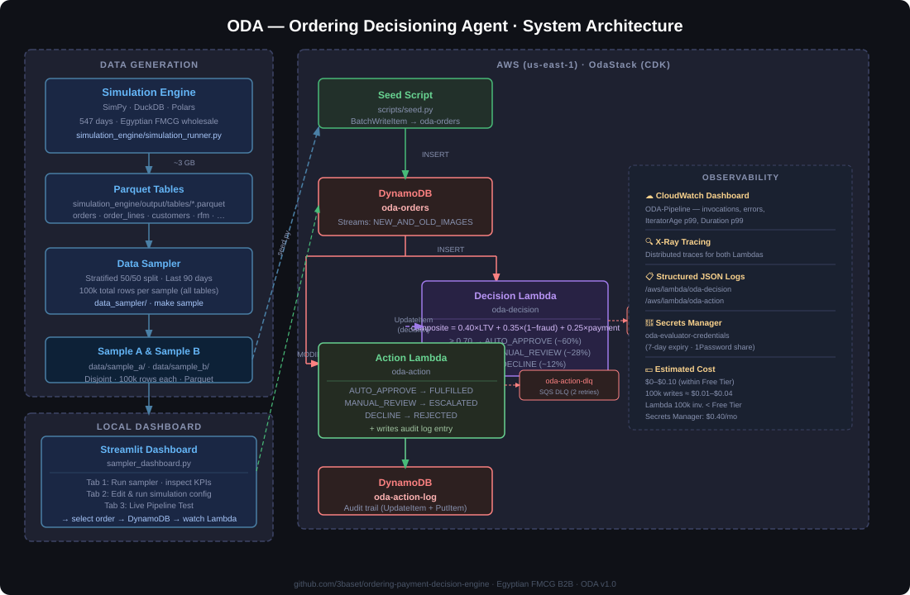

# ODA — Ordering Decisioning Agent

Synthetic Egyptian FMCG wholesale data platform with a live AWS event-driven ordering
decisioning pipeline. Includes a full simulation engine, config-driven data sampler,
interactive Streamlit dashboard, and a 100k-record holdout sample set.

---

## Architecture



---

## Contents

- [Quick Start (Makefile)](#quick-start-makefile)
- [Repository Layout](#repository-layout)
- [AWS Pipeline](#aws-pipeline-part-a)
- [Simulation Engine](#simulation-engine)
- [Data Sampler](#data-sampler)
- [Streamlit Dashboard](#streamlit-dashboard)
- [Cost & Access](#cost--access)

---

## Quick Start (Makefile)

```bash
# 1. Install all dependencies
make setup

# 2. Run the simulation engine  (~8–12 min, produces ~3 GB of Parquet)
make sim

# 3. Sample 100k total records across all tables
make sample

# 4. Launch the Streamlit dashboard
make dashboard

# 5. (Optional) Seed Sample A into the live AWS DynamoDB pipeline
make seed-smoke       # first 100 orders — smoke test
make seed             # full sample
```

**All targets:**

| Target | What it does |
|--------|-------------|
| `make setup` | Install Python dependencies |
| `make sim` | Run simulation engine (accepts `DAYS=<n>`) |
| `make sample` | Run data sampler → `data/sample_a/` + `data/sample_b/` |
| `make dashboard` | Launch Streamlit on `localhost:8501` |
| `make test` | Run 28 unit tests |
| `make seed` | Seed Sample A → DynamoDB `oda-orders` (accepts `LIMIT=<n>`) |
| `make seed-smoke` | Seed first 100 orders |
| `make deploy` | CDK deploy OdaStack to AWS |
| `make clean` | Remove simulation output and sample data |

---

## Repository Layout

```
ordering-decisioning-agent/
├── Makefile                        # One-command setup, sim, sample, deploy
├── simulation_engine/              # Discrete-event simulation (SimPy + DuckDB + Polars)
│   ├── simulation_runner.py        # Entry point  (--config, --days flags)
│   ├── config/simulation_config.yaml
│   ├── engines/                    # Domain logic (fraud, inventory, payment…)
│   ├── generators/                 # Bootstrap data (customers, SKUs, reps)
│   ├── processes/                  # SimPy processes (ordering, fulfilment, invoicing…)
│   ├── projections/                # Event-store → Parquet writers
│   ├── schemas/                    # Pydantic event schemas
│   ├── store/                      # DuckDB event store + shared state
│   └── validators/                 # Business-rule and KPI validators
│
├── data_sampler/                   # Config-driven sampling module
│   ├── config.py                   # Pydantic v2 config models
│   ├── filters.py                  # Date-window and join filters
│   ├── sampler.py                  # Orchestrator — build → cap → write
│   └── configs/last_90d.yaml       # Default: 100k total rows, last 90 days
│
├── data/                           # Sampled output (gitignored — regenerate with make sample)
│   ├── sample_a/                   # ~100k total rows across all tables
│   ├── sample_b/                   # ~100k total rows, disjoint split
│   └── reference/                  # Static lookup tables
│
├── lambdas/
│   ├── decision/handler.py         # 3-factor composite scoring (LTV + Fraud + Payment)
│   └── action/handler.py           # Downstream routing + audit log writer
│
├── infra/
│   ├── oda_stack.py                # CDK stack (DynamoDB, Lambdas, DLQs, CloudWatch)
│   └── app.py                      # CDK entry point
│
├── scripts/
│   ├── seed.py                     # Load Sample A Parquet → DynamoDB
│   └── teardown.py                 # Empty tables without destroying the stack
│
├── tests/
│   ├── test_decision_lambda.py     # 18 unit tests — scoring logic
│   └── test_action_lambda.py       # 10 unit tests — routing logic
│
├── docs/
│   ├── architecture.svg            # System architecture diagram
│   ├── Part_B_Growth_Lead_Response.md
│   ├── cost-estimate.md
│   └── iam-setup.md
│
├── sampler_dashboard.py            # Streamlit: sampler · simulation · live pipeline test
└── aws_pipeline_tab.py             # Live Pipeline Test tab module
```

---

## AWS Pipeline (Part A)

### Store Choice — DynamoDB

| Dimension | DynamoDB | S3 + Athena | RDS (PostgreSQL) |
|-----------|----------|-------------|-----------------|
| **Latency** | Single-digit ms `GetItem`/`UpdateItem` by key | Seconds per query (OLAP scan) | <10 ms but requires connection pool + VPC |
| **Access pattern** | Point lookup and update by `order_id` — exactly what a decisioning engine needs | Optimised for full-table analytics, not per-record writes | Works, but adds schema migrations and connection management overhead |
| **Cost** | On-demand billing, zero minimum; 25 GB + 200M requests/month free | Pay per query + S3 storage; acceptable for analytics, not for a write-heavy stream | Running instance 24/7 even at zero load (~$15/month minimum outside Free Tier) |
| **Streams** | Native DynamoDB Streams — trigger chain needs no additional broker | Requires EventBridge or SQS to bridge S3 events to Lambda | No native CDC without additional tools (Debezium, etc.) |

**Decision:** DynamoDB is the only store that satisfies all three constraints simultaneously — sub-10 ms point access, native stream triggers, and zero-minimum cost inside the Free Tier. S3+Athena would be the right choice if the primary workload were analytics over the full dataset rather than per-record decisioning.

### Decision Scoring Model

| Factor | Weight | Values | Signal |
|--------|--------|--------|--------|
| Customer LTV tier | 40% | premium=1.0 · standard=0.6 · new=0.4 · at-risk=0.2 · churned=0.1 | RFM segment |
| Fraud risk (inverted) | 35% | `1 − fraud_score` where fraud_score ∈ [0,1] | Fraud engine |
| Payment method × basket | 25% | credit=0.90 · bank_transfer=0.80 · cheque=0.65 · cod=0.50 · cash=0.45 | Method + relative basket deviation |

**Basket penalty** — relative to each customer's 90-day average basket:

```
basket_deviation     = max(basket / avg_basket_90d − 1.0, 0.0)
basket_risk_penalty  = min(basket_deviation / 4.0, 1.0) × 0.30
payment_score        = method_score × (1.0 − basket_risk_penalty)
composite            = 0.40×ltv + 0.35×(1−fraud) + 0.25×payment
```

**Expected distribution:** ~60% AUTO_APPROVE · ~28% MANUAL_REVIEW · ~12% DECLINE

### Deploy

```bash
npm install -g aws-cdk
make setup

cd infra
cdk bootstrap   # first time only
make deploy
```

### Seed & Verify

```bash
# Wait ≥30s after cdk deploy (stream iterator warm-up)
make seed-smoke     # 100 orders
make seed           # full sample

# Watch logs
aws logs tail /aws/lambda/oda-decision --follow
aws logs tail /aws/lambda/oda-action --follow
```

### Observability

- **CloudWatch Dashboard** `ODA-Pipeline` — invocations, errors, IteratorAge p99, Duration p99, decision distribution pie (AUTO_APPROVE/MANUAL_REVIEW/DECLINE), action distribution pie (FULFILLED/ESCALATED/REJECTED)
- **SQS DLQs** — `oda-decision-dlq` and `oda-action-dlq` after 2 retries
- **X-Ray tracing** — distributed traces for both Lambdas
- **Structured JSON logs** — every decision emits `event`, `order_id`, `outcome`, score components

---

## Simulation Engine

Models a B2B wholesale marketplace over 547 days (Jan 2023 – Jun 2024) using
discrete-event simulation (SimPy) with an event-sourced DuckDB store.

```
Generators  ──►  Bootstrap  ──►  SimPy Environment
 (customers,                       │
  SKUs, reps)                  Processes (concurrent)
                                   │  customer_arrival_process
                                   │  customer_order_process
                                   │  order_fulfillment_process
                                   │  invoice_process · collection_process
                                   │  inventory_monitor_process
                                   │  fraud_monitor_process
                                   │  rep_visit_process
                                   │  macro_process (inflation, Ramadan, promos)
                                   ▼
                              DuckDB Event Store
                                   │
                              Projections  ──►  Parquet tables (~3 GB)
                                   ▼
                              Validators  ──►  Business-rule + KPI checks
```

Run with optional overrides:
```bash
make sim                  # default config
make sim DAYS=30          # shorter run for testing
cd simulation_engine && python simulation_runner.py --config config/simulation_config.yaml --days 30
```

---

## Data Sampler

Config-driven stratified sampling with a **100k total-records-per-sample** cap.
The sampler joins all related tables first (orders → order_lines, invoices, payments,
customers, rfm_scores…), then proportionally trims the full join to hit the target.

Both samples cover the **last 90 days**, stratified by `month × channel × order_status`.
They are disjoint halves of the same population.

| Sample | Total rows | Orders | order_lines | invoices | payments | … |
|--------|-----------|--------|-------------|----------|----------|---|
| sample_a | ~100k | ~10k | ~35k | ~10k | ~10k | … |
| sample_b | ~100k | ~10k | ~35k | ~10k | ~10k | … |

Regenerate:
```bash
make sample
# or with the Streamlit dashboard → Sampler tab → sidebar → Run Sampler
```

The YAML config (`data_sampler/configs/last_90d.yaml`) controls all sampling parameters
and can be downloaded from the Streamlit sidebar.

---

## Streamlit Dashboard

```bash
make dashboard
# or: streamlit run sampler_dashboard.py
```

Three tabs:

| Tab | What you can do |
|-----|----------------|
| **📊 Sampler** | Configure total-record target, date window, seed → run → inspect KPIs, channel mix, fraud distribution, GMV trend, A vs B compare |
| **⚙️ Simulation Engine** | Edit simulation YAML config (quick-edit form or full editor), save, run — see real-time output |
| **🚀 Live Pipeline Test** | Select a record from sample data, send to DynamoDB, watch Decision + Action Lambda results appear live |

The Live Pipeline Test tab requires AWS credentials (`aws configure`) with the same
profile used for `cdk deploy`.

---

## Cost & Access

**Estimated cost: $0–$0.10** (within AWS Free Tier for the evaluation period).

| Resource | Notes |
|----------|-------|
| DynamoDB (2 tables) | 100k writes + ~100k reads ≈ $0.01–$0.04 |
| Lambda (2 functions) | 100k invocations — well within 1M/month Free Tier |
| SQS DLQs | Zero messages expected in a clean run |
| CloudWatch | First 3 dashboards free |
| Secrets Manager | `oda-evaluator-credentials` — $0.40/secret/month |

**Evaluator access:** credentials in AWS Secrets Manager → `oda-evaluator-credentials`.
See [`docs/iam-setup.md`](docs/iam-setup.md). Shared via 1Password (link sent separately).

---

## Reference Docs

| File | Purpose |
|------|---------|
| `docs/architecture.svg` | System architecture diagram |
| `docs/Part_B_Growth_Lead_Response.md` | Business response draft |
| `docs/cost-estimate.md` | Free Tier breakdown per resource |
| `docs/iam-setup.md` | Evaluator credential sharing |
| `docs/Growth_Lead_Assessment_Brief.pdf` | Original case study brief |
| `docs/claude-session.md` | Full build log (prompt → diff → findings) |
| `simulation_engine/DATA_ANALYST_GUIDE.md` | Guide for analysts querying raw tables |
